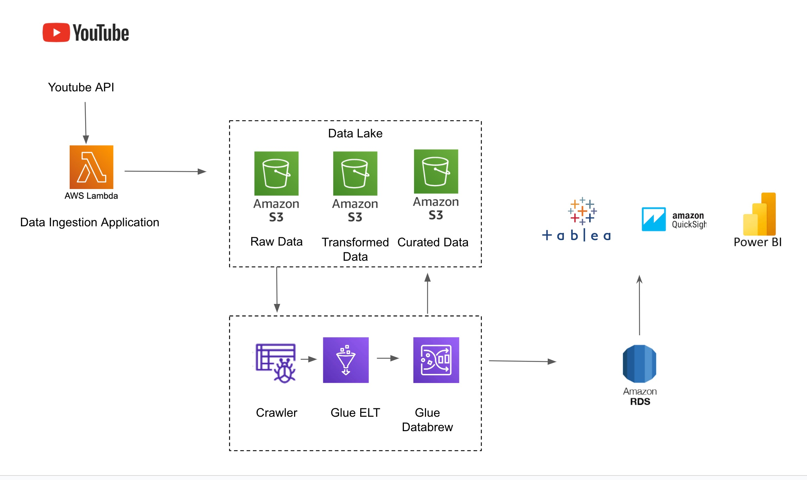
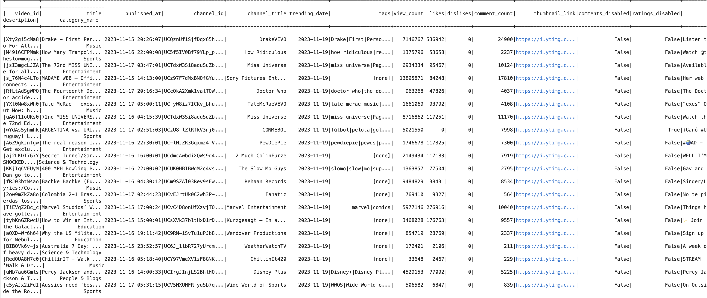
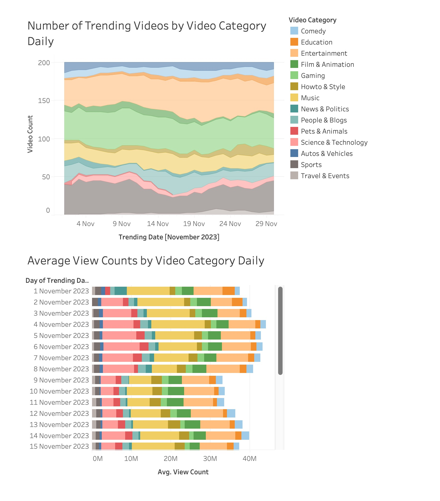
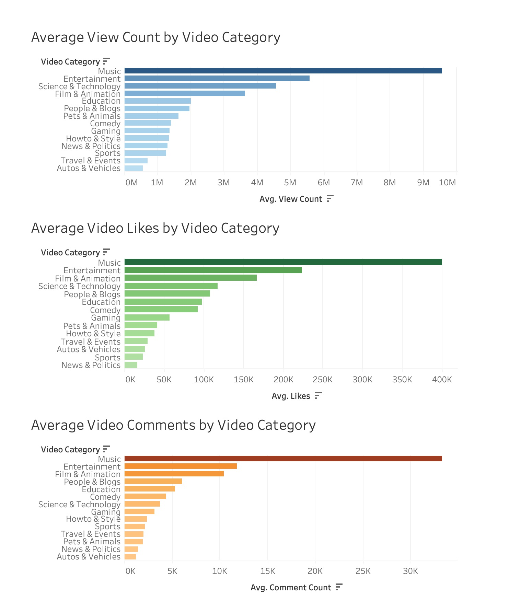
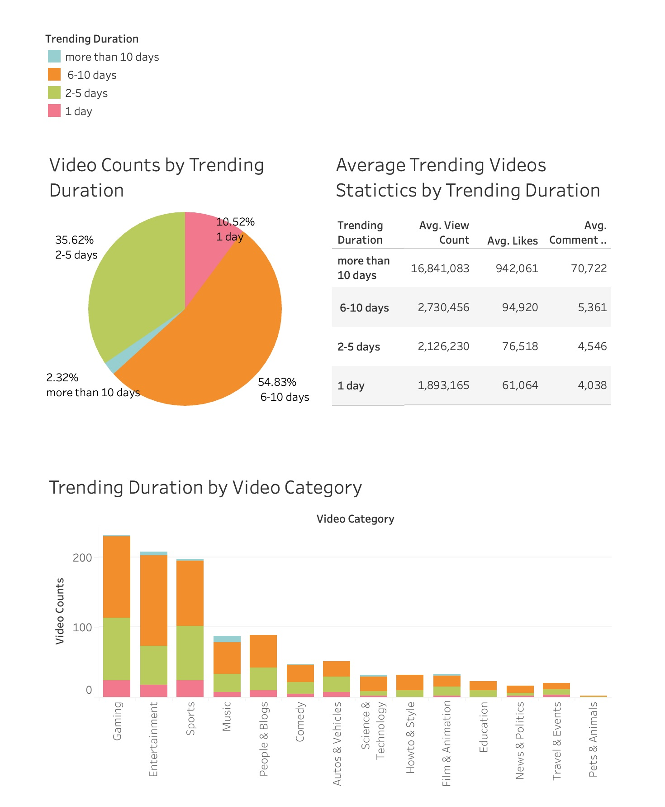

# AWS-youtube-videos-data-pipeline-DE

## Table of Contents
- [Introduction](#introduction)
- [Architecture](#architecture)
- [Technologies Used](#technologies-used)
- [Data Source](#data-source)
- [Highlighted Features](#highlighted-features)
- [Results](#results)
- [How to Run](#how-to-run)
- [Contact](#contact)

## Introduction
The objective of this project is to develop an automated data pipeline to process trending YouTube video data for the Australian market using AWS cloud-based tools. The pipeline begins with a scraper application that extracts data from the YouTube API, followed by AWS Glue, which builds a serverless ELT workflow to transform the data and prepare it for analysis. The curated data is then analyzed and visualized using Amazon Quicksight. 

## Architecture

This project consists of several critical components:
- **Data Source**: Utilizes the YouTube API to retrieve trending video data.
- **AWS Lambda**: Executes the scraper application daily to automatically extract data from the YouTube API.
- **Amazon S3**: Acts as a data lake for storing raw, transformed, and curated datasets separately.
- **Crawler** automatically infers schema information of the data and integrates it into AWS Glue Data Catalog
- **AWS DateBrew** Used to conduct data profiling and data quality check
- **AWS Glue**: Facilitates a serverless ELT workflow for data transformation and loading into the target database.
- **Amazon Athena (optional)**: Enabling efficient querying and analysis of data stored in S3.
- **Amazon Quicksight**: Used for visualization and generating reports.

## Results
### Sample Output ([Check the `output/` folder for the full sample data](data/))
This sample output contains data based on YouTube's top 200 trending videos in the AU market collected daily throughout November 2023. 

### Visualization (using sample data)
#### Dashboard 1: Analysis of Daily Trending Video Categories (November 2023)

- The stacked area chart shows the number of trending videos in each category daily for November 2023. Categories like Gaming, Entertainment, and Sports consistently dominate the daily trends, while categories such as Education, Science & Technology, and Film & Animation have lower numbers but show relatively stable trends over the month.
- The stacked bar chart displays the average daily view counts for each category. Categories like Music and Entertainment show high view counts, suggesting these categories have strong daily audience exposure and attract the most attention.
 

#### Dashboard 2: Engagement Metrics by Video Category (November 2023)

- The blue bar chart shows average video view counts per category. Music and Entertainment lead with the highest average views (approaching 9-10 million), followed by Science & Technology (around 4.56 million) and Film & Animation (around 3.6 million). Autos & Vehicles and Travel & Events have the lowest views (under 1 million).
- The green bar chart shows the average video likes per category. Music and Entertainment are the top categories for likes-clicking, closely followed by Film & Animation. Lower engagement in terms of likes is seen in categories such as Sports and News & Politics.
- The orange bar chart shows the average video comments per category. Music has the highest number of average comments which is far more than other categories, indicating strong video engagement. Entertainment and Film & Animation also receive high comment counts. Categories like News & Politics and Autos & Vehicles have fewer comments, indicating lower interaction.
- Based on the three engagement metrics, music, entertainment, and film & animation are the top 3 categories showing strong user engagement and interactions.
 

#### Dashboards 3: Analysis of Trending Duration (November 2023)

- The pie chart shows that most videos (54.83%) remain on the trending list for 6-10 days, followed by 2-5 days (35.62%). Only a small percentage of videos trend for more than 10 days (2.32%) or 1 day (10.52%). This suggests that the typical lifespan of a trending video is under 10 days, with the majority trending for a week.
- The text table highlights average engagement metrics (views, likes, and comments) for each trending duration. Videos trending for more than 10 days attract the highest engagement, with over 16 million views, indicating that longer-trending videos gain significantly more exposure. Shorter-trending videos (1 day and 2-5 days) have lower average views and interaction.
- The bar chart breaks down video counts by category and trending duration. The Gaming and Entertainment categories dominate in trending counts, with a large portion trending for 6-10 days.
Other categories such as Sports, Music, and People & Blogs also trend frequently but with shorter durations.
Categories like Pets & Animals and Travel & Events have fewer trending durations, primarily trending for just 1-2 days, reflecting lower audience reach and engagement.
